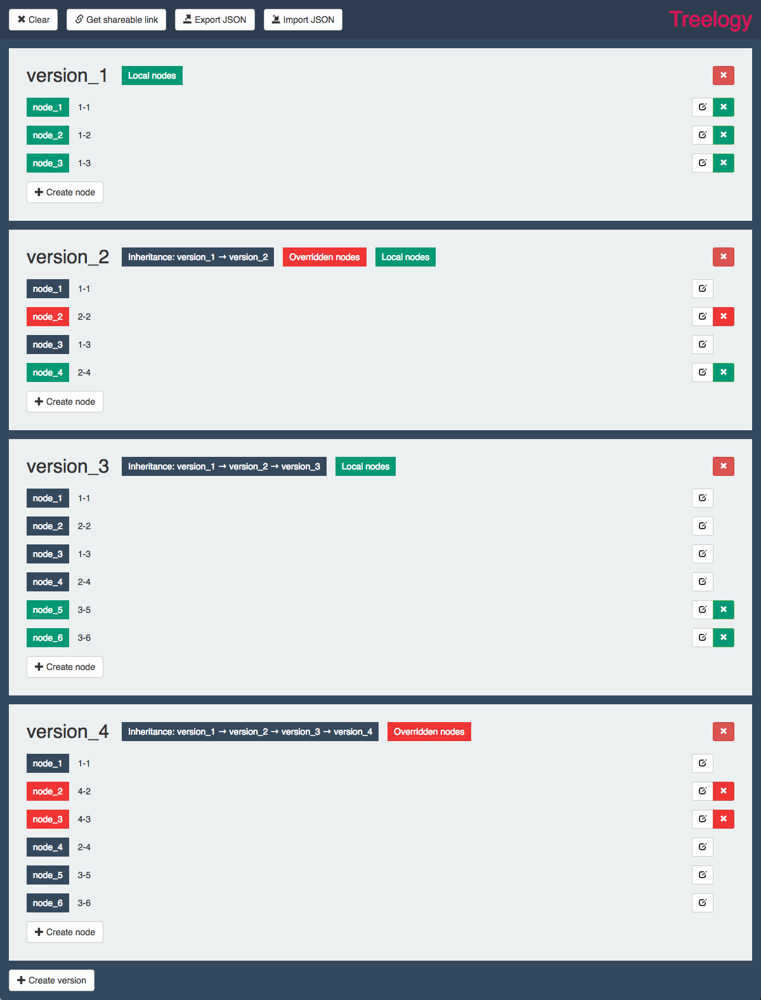

## :zap: About Treelogy Demos

Treelogy is a simple versioning framework you might want to explore here:

https://github.com/dkozar/treelogy

* `Treelogy` is inspired by class inheritance in various programming languages
* Uses a version tree to keep track of changes
* Each version contains *atomic* parts called nodes
* The node can contain any type of data and could be overridden in child version
* Each node contains only *delta*, thus minimizing the memory footprint

## :tv: Demos

1. [Blank Treelogy](http://bit.ly/2tDoDdS)
2. [Classes and inheritance](http://bit.ly/2IhAhhQ)
3. [Versioning demo](http://bit.ly/2FuLduY)
4. [Tree nodes demo](http://bit.ly/2tx0k1q)
5. [No inheritance](http://bit.ly/2DjtCQL)

## :thumbsup: Thanks to

This project was bootstrapped with [Create React App](https://github.com/facebookincubator/create-react-app). Many thanks to nice people at Facebook :rocket:
